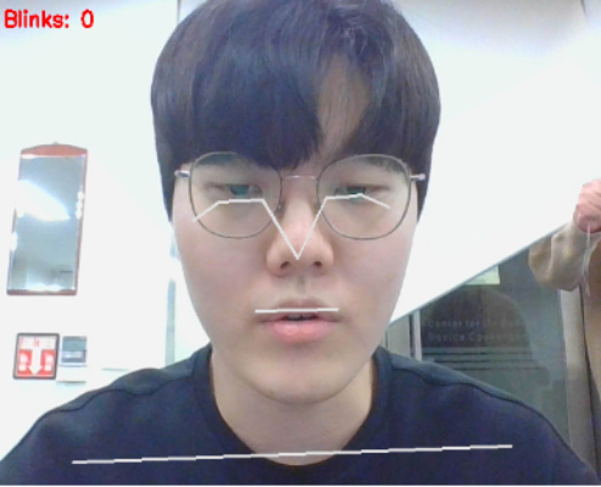
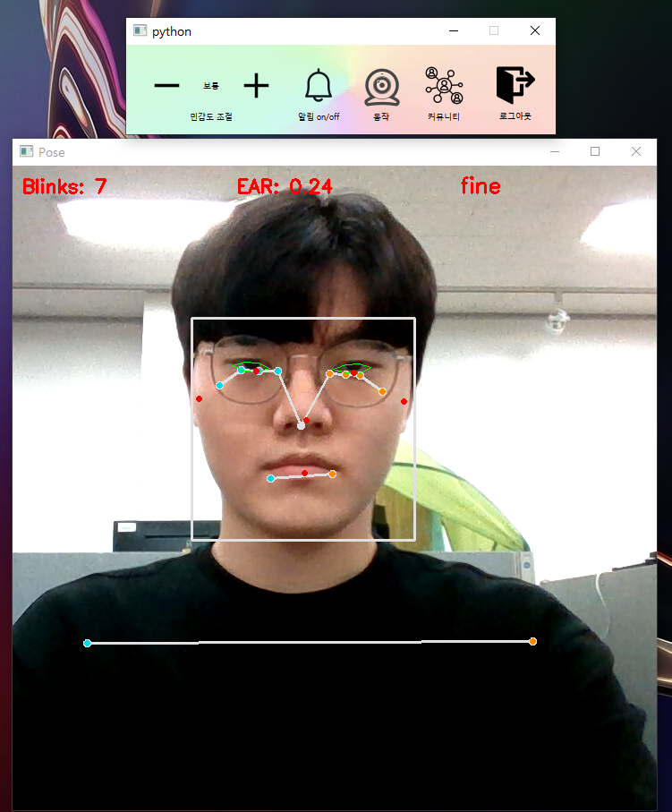
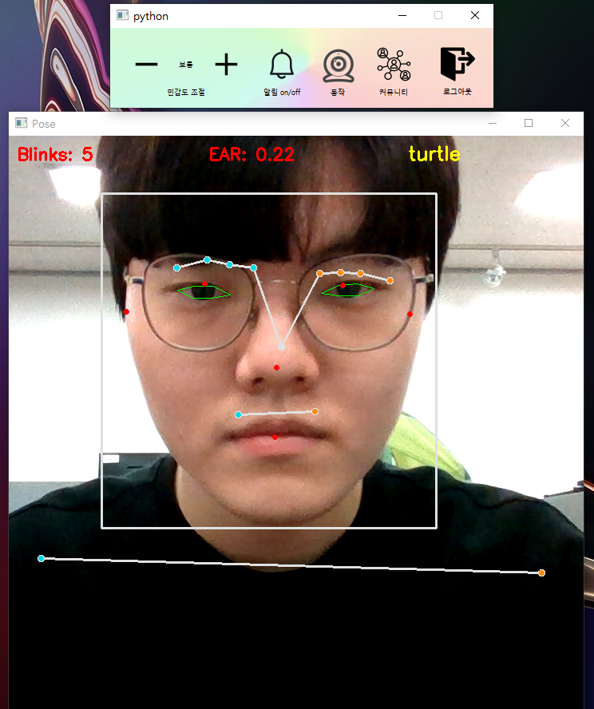
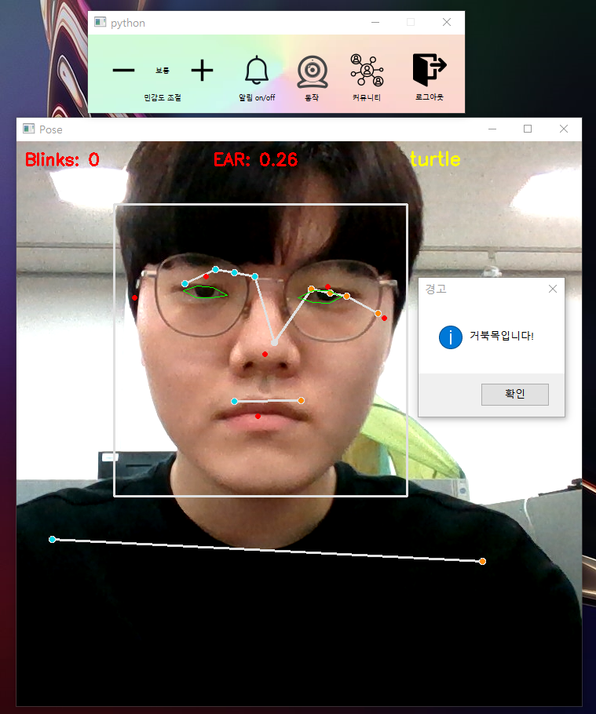
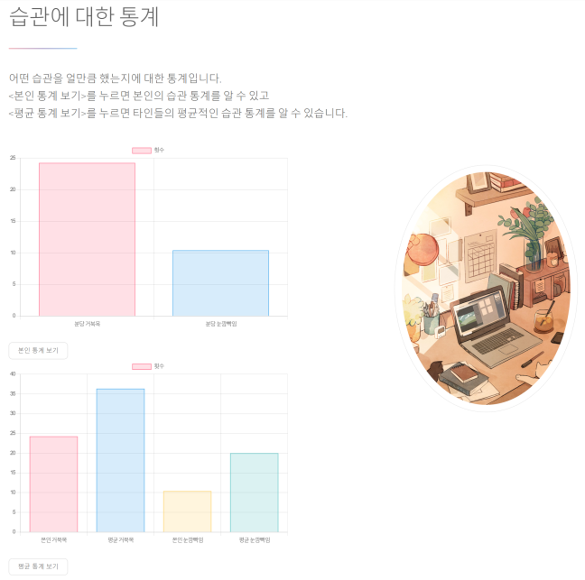

# Upright 2 AI version

 

## 프로젝트 주제
AI를 이용한 거북목 탐지 프로그램

 
  
## 프로젝트 기간
| 구분 | 기간 |
| -- | -- |
| 전체 기간 | 2022.09.01 ~ 2021.12.13 |
| 실질 개발 | 2021.10.11 ~ 2021.12.13 |

 

## 팀원 소개
| 이름    | 역할         | 스택       | 기타                            |
|---------|--------------|------------|---------------------------------|
| 류준형   | 팀장, App 백엔드  | Python, mediapipe|  눈깜빡임 감지 구현 |
| 김건호   | 인공지능 | Python, tensorflow, keras  | 거북목 증후군 학습 및 감지 구현 |
| 이상철   |  웹페이지, DB 구성 관리   | NodeJS  | 웹페이지 담당 및 데이터베이스`` |
| 조승헌   | App 프론트엔드   | PyQt        | PyQt 디자인 |
| 응웬반홍   | App 백엔드   | PyQt        | 문자 알림 서비스 |

 

## 특이사항

지난 프로젝트에서 있었던 단순 측정 방법 문제를 해결하기 위해 AI로 학습시켜 이미지 분류 모델을 만들었습니다. 정상, 거북목 이미지 5000장씩으로 학습시켰습니다.

### 결과
이렇게 AI로 분류 모델을 만들어서 프로그램을 이용하는 사람이 초기에 측정해야 결과가 보다 정확해지는 번거로움을 해결하였습니다. 물론, 정면 카메라로만 인식하다보니 정상 자세에서도 거북목을 판별하는 경우가 있었지만 카메라 2개를 쓰자니 프로그램을 쓰는데 불편함을 초래할 것이라고 생각했습니다. 그래서 조금 부정확하더라도 쓰는 사람이 프로그램을 실행시키면서 경각심을 가지고 스스로의 의지로 자세를 의식적으로 교정하는 것에 의의를 두기로 했습니다.

 

## 작동 흐름도

 

## 시스템 구성도

 

## AI 거북목 탐지

딥러닝 이미지 분류 모델로 CNN 모델을 만들었습니다.

 

## mediapipe

 

## 프로그램 화면
### 상단 컨트롤바

### 자세 교정
#### 정상 자세

 

#### 거북목 자세

  

## 웹페이지 화면
### Upright 로고

### 사진 데이터

### 교정 사이트

### 통계 데이터

